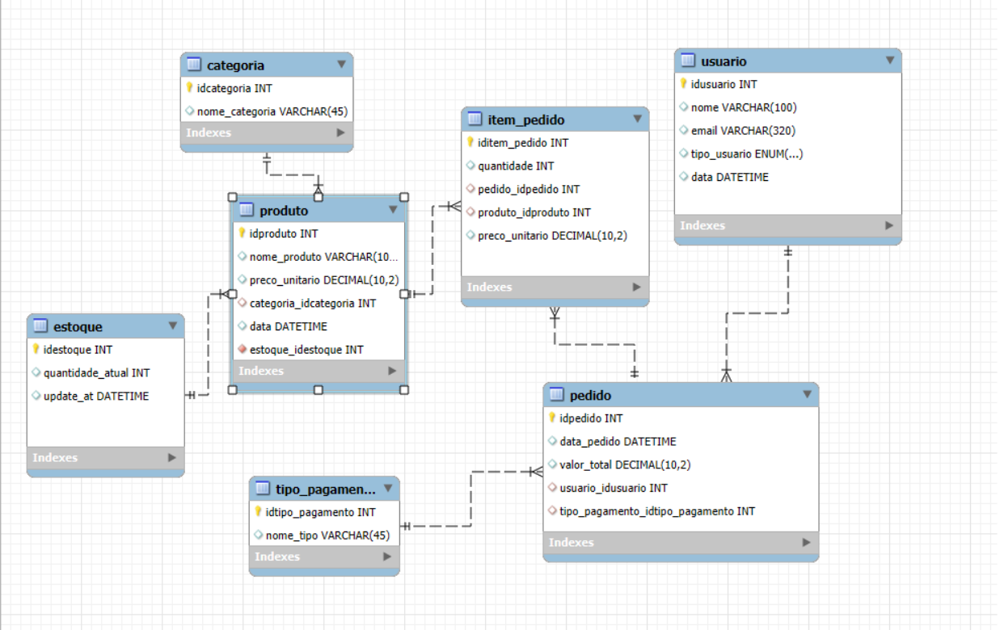
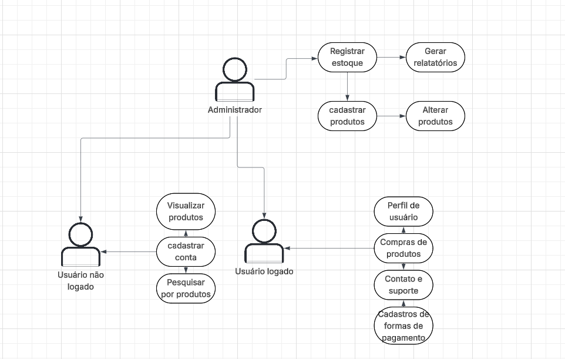

# Projeto Integrador 
Terroir Café

Um modelo para o desenvolvimento do Projeto Integrador do Curso de Técnico em Desenvolvimento de Sistemas para a Internet Integrado ao Ensino Médio do IFC - Campus Araquari.
Nosso projeto busca criar uma aplicação web para ampliar as vendas de uma pequena empresa de artigos ligados á café e sua preparação. Tendo como objetivo aumentar o alcance e oferecer uma plataforma moderna e acessível para a venda de produtos, como grãos, inteiros e moídos, filtros, moedores, máquinas de espresso, tampers, entre outros.    

Professor: [Marco André Mendes](github.com/marcoandre)

Equipe:
- [Gianluca Gadotti](github.com/Gianlucagadotti)
- [Gustavo Henrique Alves de Oliveira](github.com/GustavoAlvHnr)
- [José Carlos Mar Pereira Neto](github.com/josemarneto)

Links do projeto:
-   [Documentação (esse documento)](https://github.com/Terroir-cafe/Documentacao)
-   Backend: [Repositório](github.com/marcoandre/pi-backend) e [Publicação](https://pi-backend.herokuapp.com/)
-   Frontend: [Repositório](https://github.com/Terroir-cafe/front-end.git) e [Publicação](https://pi-frontend.herokuapp.com/)

**1.1 Modelos de Sistemas**

**1.1.1 Ponto de Vendas (PDV)**

O nosso cliente, o Terroir Café, é uma loja especializada na venda de cafés e produtos relacionados, que vem se destacando pela qualidade e variedade de seus itens. Devido ao crescimento constante e ao aumento no número de pedidos, a equipe expandiu recentemente, contando agora com novos colaboradores nas áreas de atendimento, vendas e logística. Com essa estrutura mais completa, o foco atual do Terroir Café está na melhoria da gestão do negócio. Para isso, surgiu a necessidade de implementar um sistema de controle de vendas que permita registrar de forma eficiente todas as transações realizadas.

# 2. Situação Problema

O Terroir Café é uma loja especializada na venda de cafés especiais, acessórios para preparo e itens relacionados ao universo do café. Fundada há cerca de 3 anos, a empresa vem conquistando um público fiel graças à qualidade dos produtos e ao cuidado na seleção dos grãos. O negócio é administrado por seu proprietário, que também atua diretamente nas decisões estratégicas. Atualmente, a equipe conta com aproximadamente 8 funcionários, divididos entre atendimento ao cliente, operação de caixa, estoque e logística de pedidos online.

O funcionamento do Terroir Café envolve tanto vendas presenciais quanto online. Durante o expediente, os atendentes auxiliam os clientes na escolha dos produtos, explicando características dos cafés, métodos de preparo e sugerindo combinações. Após a escolha, o cliente se dirige ao caixa, onde a venda é registrada manualmente ou em sistemas simples, como planilhas ou anotações, o que pode gerar lentidão e erros.

No caso das vendas online, os pedidos chegam por meio do site e também por redes sociais. Esses pedidos são anotados manualmente pelos funcionários responsáveis, que organizam a separação dos produtos no estoque e encaminham para envio. Esse processo depende muito da comunicação entre os funcionários, o que pode ocasionar falhas, como pedidos duplicados, atrasos ou itens enviados incorretamente.

O controle de estoque é feito de forma básica, geralmente por meio de conferências periódicas e registros manuais. Quando há grande volume de vendas, pode ocorrer divergência entre o estoque físico e o registrado, dificultando saber quais produtos precisam ser repostos. Além disso, a atualização dessas informações nem sempre é feita em tempo real.

Outro ponto importante é o controle financeiro e de vendas. Atualmente, o proprietário precisa reunir informações de diferentes fontes — como anotações do caixa, registros de pedidos online e comprovantes de pagamento — para ter uma visão geral do faturamento. Esse processo é demorado e sujeito a erros, o que dificulta a análise do desempenho do negócio e a tomada de decisões estratégicas.

Diante desse cenário, é possível identificar problemas como falta de integração entre os processos, registros manuais suscetíveis a erros, dificuldade no controle de estoque e ausência de relatórios consolidados de vendas. A implementação de um software de gestão de vendas poderia centralizar todas essas informações, automatizar processos, reduzir erros operacionais e fornecer relatórios detalhados, permitindo ao Terroir Café melhorar sua organização, eficiência e capacidade de crescimento.

# 3. Descrição da proposta

A proposta para o Terroir Café é o desenvolvimento de um sistema de controle de vendas e gestão integrado, cujo foco principal será centralizar todas as operações da loja em um único ambiente digital. O software permitirá registrar vendas, acompanhar pedidos (tanto presenciais quanto online), controlar o estoque em tempo real e gerar relatórios que auxiliem na tomada de decisões.

O sistema contará com diferentes níveis de usuários. Os administradores terão acesso às funções operacionais, como registrar vendas, consultar produtos e verificar disponibilidade em estoque, atualizar entradas e saídas de produtos, garantindo que as informações estejam sempre corretas. Por outro lado.

De forma geral, o software permitirá: registrar vendas de maneira rápida e organizada, integrar pedidos online e presenciais, manter o controle automatizado do estoque e gerar relatórios sobre faturamento, produtos mais vendidos e desempenho em determinados períodos.

# 4. Modelagem de Dados

# 4. Regras de negócio

RN01 – Cadastro de Produtos

Para cadastrar um produto, é obrigatório informar nome, preço, categoria e marca. O preço deve ser maior que zero e o produto não pode estar duplicado (mesmo nome e marca).

RN02 – Atualização de Produtos

A alteração de dados de um produto (preço, nome ou categoria) só pode ser realizada por usuários autorizados.

RN03 – Controle de Estoque

Todo produto físico deve possuir controle de estoque, sendo que a quantidade disponível não pode ser negativa.

RN04 – Reposição de Estoque

A entrada de novos produtos no estoque deve ser registrada no sistema com a quantidade adicionada e a data da movimentação.

RN05 – Inserção de Produtos na Venda

Para inserir um produto na venda, é necessário que o produto esteja cadastrado e que a quantidade informada seja maior que zero.

RN06 – Verificação de Estoque na Venda

Um produto só pode ser vendido se houver quantidade suficiente em estoque.

RN07 – Cálculo do Valor Total

O valor total da venda deve ser calculado automaticamente com base nos produtos e quantidades informadas.

RN08 – Finalização da Venda

A venda só pode ser finalizada após a definição da forma de pagamento e confirmação do valor total.

RN09 – Registro da Venda

Ao finalizar a venda, o sistema deve registrar automaticamente a data, hora e valor total da transação.

RN10 – Baixa no Estoque

Após a finalização da venda, o sistema deve atualizar automaticamente o estoque dos produtos vendidos.

RN11 – Formas de Pagamento

Toda venda deve possuir uma forma de pagamento válida (dinheiro, cartão ou PIX).

RN12 – Pagamento em Dinheiro

Para pagamentos em dinheiro, o sistema deve calcular automaticamente o troco com base no valor pago.

RN13 – Relatórios de Vendas

O sistema deve permitir a geração de relatórios de vendas por período, faturamento e produtos mais vendidos.

RN14 – Acesso aos Relatórios

Os relatórios gerenciais devem ser acessíveis apenas por usuários admistradores

RN15 – Integridade dos Dados

O sistema deve garantir que todas as vendas e movimentações sejam registradas corretamente, sem permitir dados incompletos.

# 5. Requisitos funcionais

R.F. 01 – Cadastro de Produtos:

Permite cadastrar novos produtos no sistema, como grãos, cápsulas, cafeteiras e acessórios, para que possam ser vendidos e controlados.

Dados necessários: nome, preço, categoria, marca, quantidade em estoque.
Usuários: administrador.

R.F. 02 – Atualização de Produtos:

Permite alterar informações dos produtos cadastrados, garantindo que os dados estejam sempre atualizados.

Dados necessários: id do produto, nome, preço, categoria, marca, estoque.
Usuários: administrador.

R.F. 03 – Registro de Entrada de Estoque:

Permite registrar a entrada de novos produtos ou reposição no estoque.

Dados necessários: id do produto, quantidade, data da entrada.
Usuários: administrador.

R.F. 04 – Registro de Usuários:

Permite cadastrar funcionários no sistema para controle de acesso.

Dados necessários: nome, login, senha, nível de acesso.
Usuários: administrador.

Processos
R.F. 05 – Autenticação de Usuário:

Realiza a validação de acesso ao sistema, permitindo que apenas usuários cadastrados utilizem as funcionalidades.

Dados necessários: login, senha, nível de acesso.
Usuários: todos os usuários.

R.F. 06 – Abertura de Venda:

Permite iniciar uma nova venda no sistema para registro dos produtos adquiridos pelo cliente.

Dados necessários: data, hora, identificador da venda.
Usuários: administrador.

R.F. 07 – Inserção de Produtos na Venda:

Permite adicionar produtos à venda, informando a quantidade desejada.

Dados necessários: id do produto, quantidade, preço unitário.
Usuários: administrador.

R.F. 08 – Cálculo do Valor Total da Venda:

Calcula automaticamente o valor total da venda com base nos itens inseridos.

Dados necessários: lista de produtos, quantidade, preço.
Usuários: sistema.

R.F. 09 – Finalização da Venda:

Permite concluir a venda após a definição da forma de pagamento.

Dados necessários: valor total, forma de pagamento.
Usuários: administrador.

R.F. 10 – Controle de Estoque:

Atualiza automaticamente o estoque após a realização ou cancelamento de uma venda.

Dados necessários: id do produto, quantidade vendida.
Usuários: sistema.

R.F. 11 – Cancelamento de Venda:

Permite cancelar uma venda realizada, mediante autorização.

Dados necessários: id da venda, motivo do cancelamento.
Usuários: administrador.

Saídas
R.F. 12 – Relatório de Vendas:

Exibe informações sobre vendas realizadas em um determinado período.

Dados necessários: data, produtos vendidos, quantidade, valor total.
Usuários: administrador.

R.F. 13 – Relatório de Produtos Mais Vendidos:

Apresenta os produtos com maior volume de vendas.

Dados necessários: nome do produto, quantidade vendida.
Usuários: administrador.

R.F. 14 – Relatório de Estoque:

Exibe a quantidade disponível de produtos e alerta para itens com baixo estoque.

Dados necessários: nome do produto, quantidade em estoque.
Usuários: administrador.

R.F. 15 – Consulta de Produtos:

Permite visualizar os produtos cadastrados no sistema.

Dados necessários: nome, preço, categoria, marca, estoque.
Usuários: todos os usuários.

# 6. Requisitos não funcionais

R.N.F. 01 - Navegadores:
O sistema deverá ser compatível com os navegadores Google Chrome e Mozilla Firefox em suas versões mais recentes.

R.N.F. 02 - Desempenho:
O sistema deve ser capaz de processar vendas e consultas em até 2 segundos, mesmo com múltiplos usuários simultâneos.

R.N.F. 03 - Segurança:
O sistema deve garantir que apenas usuários autenticados possam fazer compras

R.N.F. 04 - Controle de Acesso:
O sistema deve possuir diferentes níveis de acesso (administrador e cliente),limitando funcionalidades conforme o perfil.

R.N.F. 05 - Disponibilidade:
O sistema deve estar disponível 24 horas por dia, com no mínimo 99% de disponibilidade.

R.N.F. 06 - Usabilidade:
O sistema deve possuir interface simples, intuitiva e de fácil utilização para os funcionários da loja.

R.N.F. 07 - Confiabilidade:
O sistema deve garantir que as informações de vendas e estoque sejam armazenadas corretamente, sem perda de dados.

R.N.F. 08 - Banco de Dados:
O sistema será implementado utilizando banco de dados MySQL.

R.N.F. 09 - Tecnologias Utilizadas:
O sistema deverá ser desenvolvido utilizando HTML5, CSS3, JavaScript utilizando framework vuejs, Python utilizando framework django e SQL.

R.N.F. 10 - Manutenção:
O sistema deve ser desenvolvido de forma organizada, permitindo fácil manutenção e atualização futura.

R.N.F. 11 - Compatibilidade:
O sistema deve ser acessível em diferentes dispositivos, como computadores e notebooks.

# 7. Diagrama de Caso de Uso

Usuário não logado: Tem acesso aos produtos porém sem a opção de compra, possui acesso ao cadastro de usuário e de login

Usuário logado: Tem acesso aos produtos e até a compra deles, pode gerenciar seu perfil e cadastrar formas de pagamento

Administrador: Tem acesso ao estoque dos produtos e suas quantidades, ele também pode cadastrar e alterar produtos 